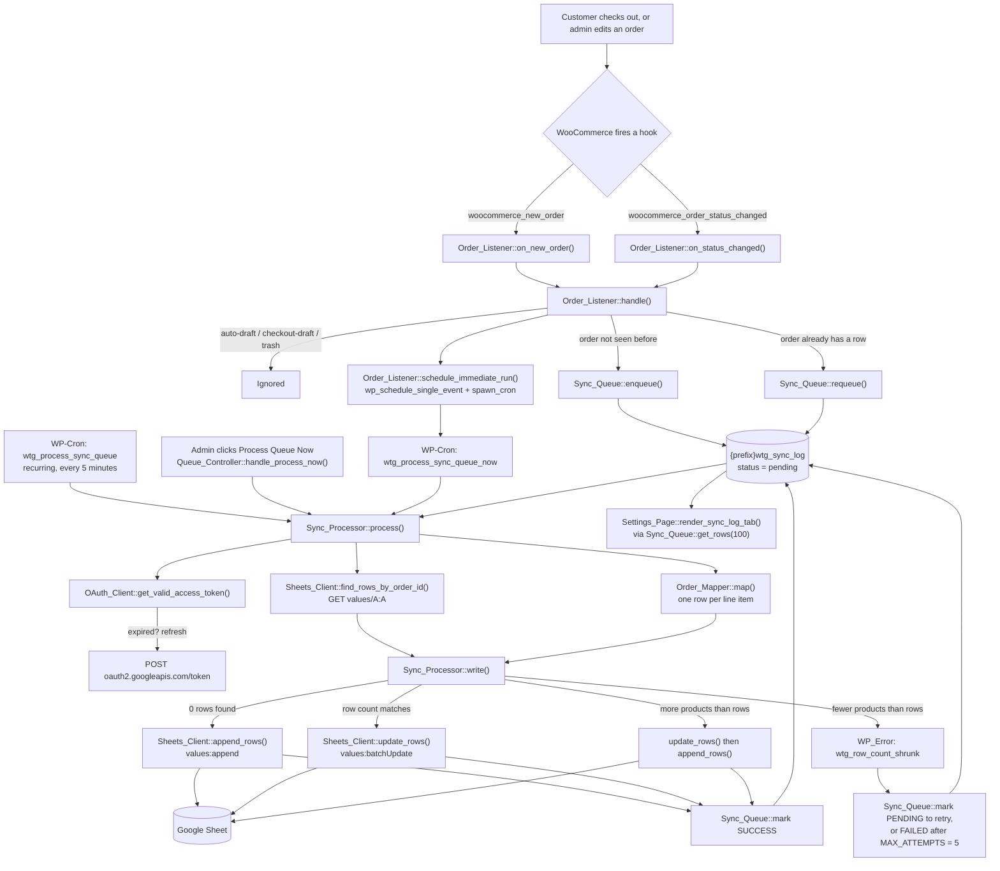
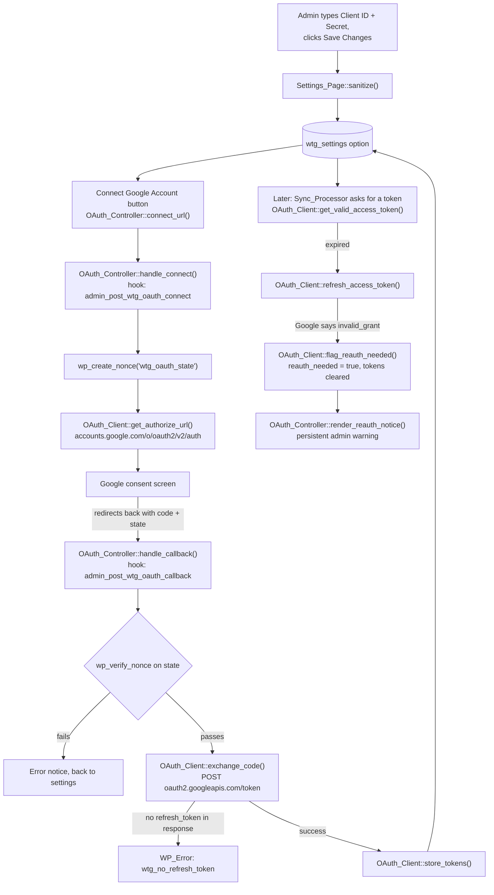

# 00 — Overview

**Plugin:** WooCommerce to Google Sheets
**Text domain:** `woo-to-gsheet`
**Namespace root:** `WTG\`
**Version:** `0.1.0` (from `WTG_VERSION` in `woo-to-google-sheets.php`)
**Requires:** PHP 7.4, WordPress 5.8, WooCommerce

## What it does, in one paragraph

When a WooCommerce order is created or changes status, the plugin writes a **row per
product** into a Google Sheet you own. It never calls Google during checkout. Instead the
order ID is dropped into a small database table, and a background WP-Cron job does the
slow, failure-prone work of talking to Google. If an order is already in the sheet, its
rows are **overwritten in place**, so changing an order from `processing` to `completed`
updates the existing rows instead of adding duplicates.

Which columns are written is configurable on the **Fields** tab, and a **Write Header Row**
button puts matching labels in row 1 — so the sheet's header, its data, and the settings all
describe the same columns. Include no per-product field and each order collapses to a single
row instead of one per product.

## Full file tree

```
woo-to-google-sheets/
├── woo-to-google-sheets.php          Bootstrap: constants, autoloader, lifecycle hooks
├── uninstall.php                     Destructive cleanup, only on plugin delete
├── readme.txt                        WordPress.org style readme (partly out of date — see below)
├── docs/                             ← this documentation
└── includes/
    ├── class-autoloader.php          Maps WTG\… class names to files
    ├── class-plugin.php              Singleton; owns constants + per-request hook wiring
    ├── class-activator.php           Creates the table, schedules cron (on activation)
    ├── class-deactivator.php         Clears cron (on deactivation)
    ├── class-settings.php            Read/write wrapper around the single wtg_settings option
    ├── Admin/
    │   ├── class-settings-page.php   Top-level admin page, tabs, Settings API fields
    │   ├── class-oauth-controller.php  connect / callback / disconnect / test actions
    │   └── class-queue-controller.php  process-now / retry / clear-log actions
    ├── Google/
    │   ├── class-oauth-client.php    OAuth2 authorization-code flow + token storage
    │   └── class-sheets-client.php   Sheets API v4: append, find rows, batch update
    ├── Queue/
    │   ├── class-sync-queue.php      All SQL against {prefix}wtg_sync_log
    │   └── class-sync-processor.php  The cron callback that actually syncs
    └── WooCommerce/
        ├── class-order-listener.php  Hooks WooCommerce order events → queue
        └── class-order-mapper.php    WC_Order → array of spreadsheet rows
```

17 files, ~3,470 lines. There is **no `.git` folder** in this project, so nothing here is
derived from commit history — see `09-development-timeline.md` for how the build order was
reconstructed instead.

## Where to start reading

| If you want to… | Read |
|---|---|
| Understand how the folders divide responsibility | `01-architecture.md` |
| Follow WordPress booting the plugin | `02-bootstrap-and-core.md` |
| Change what gets written to the sheet | `04-woocommerce.md` (`Order_Mapper`) |
| Debug a sync that failed | `05-queue.md` then `03-google.md` |
| Add a settings field | `06-admin.md` and `08-settings-reference.md` |
| Add a column, status, or destination | `10-extending-the-plugin.md` |

## Diagram 1 — the main runtime flow

Every arrow below is a real method call or hook registration found in the code.



## Diagram 2 — the OAuth connect flow



## Known documentation drift in the source

Several docblocks and `readme.txt` predate later changes. The **code** is authoritative;
these comments are not:

| Location | Says | Reality |
|---|---|---|
| `readme.txt` lines 36–40 | Columns A–J, one row per order, a "Products" column | Up to **12 selectable** columns, one row **per product** (`Order_Mapper::fields()`) |
| `readme.txt` line 39 | "add a matching header row manually" | The **Write Header Row** button does it |
| `readme.txt` lines 15, 24 | Only `processing`/`completed` sync | **Every** status syncs except drafts (`Order_Listener::EXCLUDED_STATUSES`) |
| `readme.txt` line 30 | Rows are appended | Rows are **upserted** (`Sync_Processor::write()`) |
| `Settings_Page::render_section_intro()` | "You will connect the account in the next phase" | Connecting happens on this same screen |
| `Settings_Page::render_sync_log_tab()` docblock | "placeholder until Phase 6" | Fully implemented |
| `Settings_Page::render_sync_log_tab()` empty-state text | "once they reach processing or completed" | Any non-draft status |
| `Sync_Queue::exists()` docblock | "one order = one sheet row" | One order = one **queue** row, but N sheet rows |
| `Sync_Processor` class docblock | "appends it to the sheet" | Appends **or** updates |

`10-extending-the-plugin.md` lists these as good first cleanup tasks.
