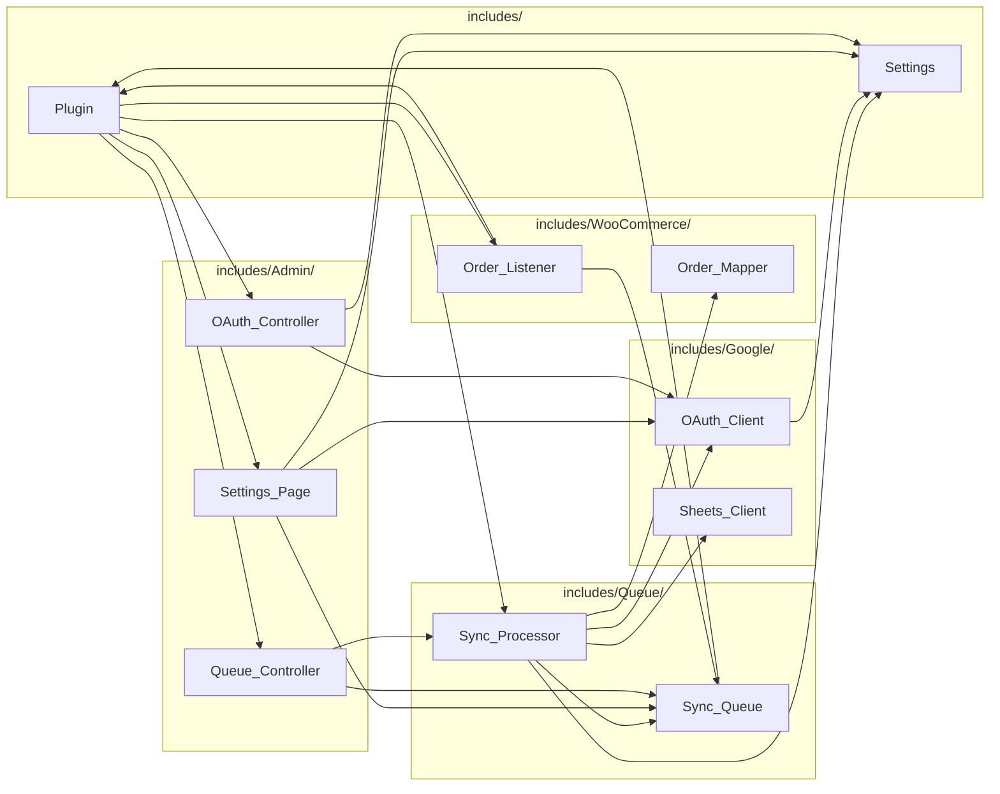

# 01 — Architecture: how the folders relate

The plugin has four sub-folders under `includes/`, plus five loose files at the
`includes/` root. Each folder is a **namespace** (`WTG\Google\`, `WTG\Queue\`,
`WTG\WooCommerce\`, `WTG\Admin\`), and the split is not cosmetic — each one owns exactly
one kind of risk.

## The one-sentence version of each folder

| Folder | Owns | Never does |
|---|---|---|
| `includes/` (root) | Booting, constants, option storage | Talk to WooCommerce, Google, or the queue table |
| `includes/WooCommerce/` | Knowing what a WooCommerce order *is* | Talk to Google, or run SQL |
| `includes/Queue/` | The `wtg_sync_log` table and the sync algorithm | Know how HTTP or OAuth works |
| `includes/Google/` | HTTP conversations with Google | Know what an "order" is |
| `includes/Admin/` | Buttons, forms, screens, nonces | Contain business logic |

The rule that falls out of this: **an order object never reaches `Google/`, and an access
token never reaches `WooCommerce/`.** `Queue/` is the only place the two meet.

---

## `includes/` (root) — bootstrap and shared services

**Files:** `class-autoloader.php`, `class-plugin.php`, `class-activator.php`,
`class-deactivator.php`, `class-settings.php`

### Why it exists as its own level

These are the things every other folder needs but that belong to none of them. `Plugin`
holds the constants (`CRON_HOOK`, `TABLE_SUFFIX`) that both `Queue/` and `WooCommerce/`
reference. `Settings` is the only code in the plugin that calls `get_option()` /
`update_option()`.

### What breaks if you merge it away

- Put `Settings` inside `Google/` and `Sync_Processor` would have to `use WTG\Google\Settings`
  just to read `spreadsheet_id` — an odd dependency that implies Google owns your config.
- Put `Plugin::table_name()` inside `Queue/` and `Activator` (which creates the table)
  would depend on the queue module purely for a string.
- Losing the single `Settings` wrapper is the real cost: today, changing where settings
  live is a one-file change. Scattered `get_option()` calls would make that a rewrite.

### Who talks to whom

- **Called by:** everyone. `Settings::get()` is used in `Google/class-oauth-client.php`,
  `Queue/class-sync-processor.php`, `Admin/class-settings-page.php`,
  `Admin/class-oauth-controller.php`.
- **Calls into:** `Plugin::run()` instantiates `WooCommerce\Order_Listener`,
  `Queue\Sync_Processor`, `Admin\Settings_Page`, `Admin\OAuth_Controller`,
  `Admin\Queue_Controller`. This is the **only** place those classes are wired to hooks.

---

## `includes/WooCommerce/` — the WooCommerce boundary

**Files:** `class-order-listener.php`, `class-order-mapper.php`

### Why it exists as its own module

This folder is the only place that knows WooCommerce's vocabulary — `WC_Order`,
`woocommerce_order_status_changed`, `get_billing_email()`, `WC_Order_Item_Product`. Every
WooCommerce-specific assumption is quarantined here.

That matters because WooCommerce changes. When it moved orders to HPOS (custom tables
instead of posts), nothing in this plugin needed to change — because only these two files
ever touch an order, and they do it through WooCommerce's own API rather than the database.

### What breaks if you merge it away

- Merge `Order_Mapper` into `Queue/` and the processor would need `WC_Order` knowledge to
  do its job. Right now `Sync_Processor` treats mapper output as an opaque array of arrays,
  which is why the mapper can be rewritten (12 columns, one row per product) without the
  processor changing at all.
- Merge `Order_Listener` into `Admin/` and it would stop running. The listener must fire on
  the **front end** during checkout; `Admin/` classes are only instantiated inside
  `if ( is_admin() )` in `Plugin::run()`.

### Who talks to whom

- **Depends on:** `WTG\Plugin` (for `CRON_HOOK_NOW`) and `WTG\Queue\Sync_Queue` — see the
  `use` statements at the top of `class-order-listener.php`. `Order_Mapper` has **no `use`
  statements at all**; it depends on nothing but WooCommerce itself.
- **Depended on by:** `Queue\Sync_Processor` uses `WTG\WooCommerce\Order_Mapper`.
  Nothing anywhere calls `Order_Listener` directly — WordPress calls it via hooks.

Note the direction: `WooCommerce/` → `Queue/` (the listener enqueues), and `Queue/` →
`WooCommerce/` (the processor maps). That is a two-way dependency between the folders, but
not between the *classes*: `Order_Listener` → `Sync_Queue`, and `Sync_Processor` →
`Order_Mapper`. No class depends on a class that depends on it.

---

## `includes/Queue/` — durability and the sync algorithm

**Files:** `class-sync-queue.php`, `class-sync-processor.php`

### Why it exists as its own module

**This folder exists so that no other part of the plugin ever calls the Google Sheets API
directly — everything becomes a queue row first.** That single rule buys three things that
would otherwise be impossible:

1. **Checkout never waits on Google.** The listener does one fast local `INSERT` and
   returns. If Google is slow or down, the customer never knows.
2. **Retries exist.** A row has `attempts` and a `status`. `Sync_Processor` can put a row
   back to `pending` and try again later, up to `MAX_ATTEMPTS = 5`.
3. **Failures are visible.** `last_error` is a column, so the admin Sync Log can show
   exactly why something did not sync.

`Sync_Queue` is a pure data-access class: **every SQL statement in the plugin lives in this
one file.** `Sync_Processor` is the algorithm: token → map → look up → append or update →
record outcome.

### What breaks if you merge it away

- Call `Sheets_Client` from `Order_Listener` and checkout gains a 20-second Google timeout
  in its critical path. A Google outage becomes a store outage.
- Spread the SQL across the plugin and the table schema stops being changeable in one
  place. Today, `07-database-schema.md` can be verified by reading one file.
- Merge processor into queue and the class would both own storage and own the sync
  algorithm — the two things most likely to change independently.

### Who talks to whom

- `Sync_Queue` depends on **only** `WTG\Plugin` (for `Plugin::table_name()`).
  It is called by `WooCommerce\Order_Listener`, `Queue\Sync_Processor`,
  `Admin\Queue_Controller`, and `Admin\Settings_Page`.
- `Sync_Processor` is the plugin's integration point. Its `use` block imports
  `WTG\Settings`, `WTG\Google\OAuth_Client`, `WTG\Google\Sheets_Client`, and
  `WTG\WooCommerce\Order_Mapper` — four modules in one class, which is exactly why it is
  the only class allowed to do so.
- `Sync_Processor::process()` is invoked by WordPress via two cron hooks, and directly by
  `Admin\Queue_Controller::handle_process_now()`.

---

## `includes/Google/` — the HTTP boundary

**Files:** `class-oauth-client.php`, `class-sheets-client.php`

### Why it exists as its own module

Everything that speaks HTTP to Google lives here, and **nothing here knows what an order
is**. `Sheets_Client::append_rows()` takes `array $rows` — plain arrays of scalars. It has
no idea a row represents a product line.

The folder is also split internally along a real seam: `OAuth_Client` owns *credentials and
tokens*, `Sheets_Client` owns *spreadsheet data*. `Sheets_Client` never fetches a token —
it takes `$access_token` as its last parameter on all three public methods. That is a
deliberate choice: it makes `Sheets_Client` trivially testable and means token-refresh logic
exists in exactly one place.

### What breaks if you merge it away

- Merge `OAuth_Client` into `Sheets_Client` and every Sheets call would carry the ability to
  mutate stored tokens as a side effect. Debugging "why did my refresh token vanish?" would
  mean auditing every API call instead of one class.
- Inline the HTTP into `Sync_Processor` and you lose the boundary that makes the retry logic
  readable — the processor would be handling `wp_remote_post()` return shapes *and* queue
  bookkeeping in the same loop.
- Adding a second destination (Excel, a webhook) currently means adding a sibling class
  here. Merged, it would mean surgery on the processor.

### Who talks to whom

- `OAuth_Client` depends on **only** `WTG\Settings`. Called by
  `Queue\Sync_Processor`, `Admin\OAuth_Controller`, and `Admin\Settings_Page`
  (which uses `is_connected()` and `has_credentials()` to decide which buttons to show).
- `Sheets_Client` has **no `use` statements** — zero plugin dependencies. Its only caller is
  `Queue\Sync_Processor`.
- One wrinkle worth knowing: `Admin\OAuth_Controller::fetch_spreadsheet_title()` makes its
  own small Sheets request using its own `SHEETS_API` constant, rather than going through
  `Sheets_Client`. See `06-admin.md` for why, and `10-extending-the-plugin.md` for how to
  consolidate it.

---

## `includes/Admin/` — screens and actions

**Files:** `class-settings-page.php`, `class-oauth-controller.php`, `class-queue-controller.php`

### Why it exists as its own module

Everything here is about a human clicking something: rendering HTML, checking nonces,
checking `manage_options`, setting admin notices, redirecting. **It should contain no
business logic** — the controllers coordinate, they do not compute.

Look at `Queue_Controller::handle_process_now()`: it checks the nonce, calls
`( new Sync_Processor() )->process()`, formats the counts into a notice, and redirects.
Four lines of real work. The sync logic is entirely in `Queue/`.

The folder splits into a **page** (`Settings_Page`, which renders) and two **controllers**
(which act and redirect). That is the Post/Redirect/Get pattern: actions live on
`admin-post.php` so that refreshing the browser after connecting or clearing the log cannot
repeat the action.

### What breaks if you merge it away

- Everything here is loaded only inside `if ( is_admin() )` in `Plugin::run()`. Merging admin
  code into `Queue/` or `Google/` would drag settings-page rendering into every front-end
  page load, including checkout.
- Merge the controllers into `Settings_Page` and the OAuth callback would have to be handled
  during page rendering — but the callback must `wp_safe_redirect()` **before any output**.
  The separation is what makes that safe.

### Who talks to whom

- `Settings_Page` imports `WTG\Settings`, `WTG\Google\OAuth_Client`, `WTG\Queue\Sync_Queue`.
  It also calls `OAuth_Controller` and `Queue_Controller` static URL builders — no `use`
  needed, since all three are in `WTG\Admin`.
- `OAuth_Controller` imports `WTG\Settings` and `WTG\Google\OAuth_Client`.
- `Queue_Controller` imports `WTG\Queue\Sync_Queue` and `WTG\Queue\Sync_Processor`.
- Both controllers call `Settings_Page::url()` when redirecting — that method is the single
  source of truth for the page's URL, so moving the menu cannot break their redirects.

---

## The dependency graph

Two things to notice:

1. **`Sheets_Client` and `Order_Mapper` are leaves.** Nothing depends on them except
   `Sync_Processor`, and they depend on nothing. Those are the two easiest files to change.
2. **`Sync_Processor` is the hub.** It is the only class importing from three different
   modules. If a change feels hard, it is usually because it belongs here.
