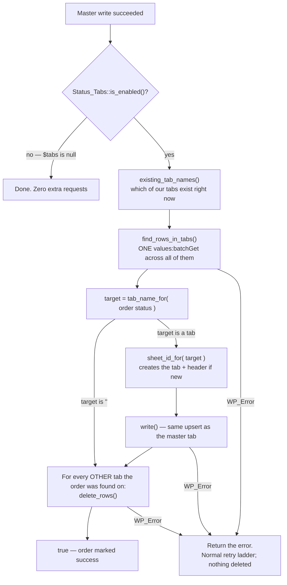

# 11 — Per-status tabs

**Feature:** an order is also written to a tab named after its current order status, and when
its status changes the row **moves** between those tabs.

**Off by default.** `status_tabs_enabled` defaults to `false`, so an existing install upgrades
to a plugin that behaves exactly as it did before — no tabs appear, no rows move, and not one
extra HTTP request is made.

**Files:** `includes/Sheets/class-status-tabs.php` (all the policy),
`Queue/class-sync-processor.php::route()` (the algorithm), four new methods on
`Google/class-sheets-client.php`, and the Status Tabs admin tab.

---

## The one thing to understand first

**Status tabs are *in addition to* the master tab, never instead of it.**

Every order still goes to the tab named in `sheet_name` on the Connection tab, upserted exactly
as documented in `05-queue.md`. Nothing in this feature reads, writes, or deletes anything on
the master tab. If you switch the feature off, the master tab is already complete and correct.

That decision is what makes the feature safe to turn on and off: the authoritative copy of the
data never participates in the moving.

---

## Why "real routing" and not a filtered view

There were two ways to give each status its own tab:

| Approach | How | Why it was rejected / chosen |
|---|---|---|
| Formula views | Write a `FILTER()` / `QUERY()` formula into each tab | Rejected. The tabs would be read-only derivatives — a human editing one would have their edit overwritten. Formulas also break when the master tab's column layout changes on the Fields tab |
| **Real routing** | Physically write the row to the new tab and delete it from the old | **Chosen.** Each tab is real data that can be sorted, filtered, coloured and exported like any sheet |

Real routing has one unavoidable consequence, and it is worth stating plainly:

> **This feature deletes spreadsheet rows.** `Sync_Processor::write()` has a long-standing rule
> that it refuses to delete rows (see `wtg_row_count_shrunk` in `05-queue.md`). Moving an order
> between tabs is impossible without deletion, so that rule is deliberately walked back — but
> only for this one purpose, and only ever against row numbers that an order-ID lookup returned
> moments earlier. `write()` itself still refuses to delete.

---

## Why nothing remembers which tab an order is on

There is no `current_tab` column, no post meta, nothing stored anywhere about an order's
location. Every sync asks the spreadsheet.

This is the same rule `find_rows_by_order_id()` already follows for the master tab, for the same
reason: **a sheet is a document a human edits.** Rows get sorted, moved, and deleted by hand.
Any location the plugin remembered would quietly go stale, and acting on a stale location means
deleting the wrong row. A lookup always tells the truth.

It also means the feature needs **no migration**. Turn it on and the next sync of each order
puts it where it belongs; orders that never sync again simply stay on the master tab, which is
correct.

The cost is one extra read per batch — and `find_rows_in_tabs()` makes that cost *one* request
regardless of how many tabs exist.

---

## The algorithm — `Sync_Processor::route()`

Three steps, and **the order of the last two is the whole safety argument**.



### 1. Ask where the order is

```php
$searchable = $tabs->existing_tab_names();
$found      = $sheets->find_rows_in_tabs( $spreadsheet_id, $searchable, $order_id, $token );
```

Only tabs that **already exist** may be searched. A `values:batchGet` naming a range on a
missing tab fails the *entire* request, taking every other tab's result down with it — so a tab
we have not created yet is filtered out rather than searched hopefully.

### 2. Write to the tab it belongs on now

```php
$target = Status_Tabs::tab_name_for( $order->get_status() );

if ( '' !== $target ) {
    $sheet_id = $tabs->sheet_id_for( $target );   // ← this is what CREATES the tab
    $existing = isset( $found[ $target ] ) ? $found[ $target ] : array();
    $result   = $this->write( $sheets, $spreadsheet_id, $target, $existing, $new_rows, $token );
}
```

Two details:

- **`sheet_id_for()` is called before the write, not after.** The write addresses the tab by
  name, but on the first order to reach a status that name does not exist yet. `sheet_id_for()`
  is what creates the tab and gives it a header row.
- **`write()` is reused verbatim** from the master path, so a status tab gets identical upsert
  behaviour: overwrite in place, append surplus product rows, and the same
  `wtg_row_count_shrunk` refusal when products were removed. A tab that was just created cannot
  appear in `$found` (it was not searchable), so a first-time status correctly falls through to
  an append.

### 3. Delete from everywhere else

```php
foreach ( $found as $name => $rows ) {
    if ( $name === $target ) { continue; }        // just reconciled — this is where it lives
    $sheet_id = $tabs->sheet_id_for( $name );     // cached map read, not a request
    $sheets->delete_rows( $spreadsheet_id, $sheet_id, $rows, $token );
}
```

### Why write-before-delete is non-negotiable

If the request dies between step 2 and step 3, the order is visible on **two** tabs. That is
untidy, obvious, and completely self-healing — the next sync of that order finds it on both and
deletes the stale one.

Delete first and die, and the row is **gone**. A visible duplicate beats lost data every time.

### `target === ''` still sweeps

An order whose status has no tab — the status is untracked, or its name clashes with the master
tab — skips step 2 but **still runs step 3**. "Belongs on no status tab" is a real destination,
not a no-op: the order must not be left behind on the tab it used to be on. It stays on the
master tab either way.

### Failure handling

Any `WP_Error` out of `route()` becomes the row's result and enters the normal retry ladder
(`05-queue.md`). The master write already succeeded by then, but that is harmless — it is
idempotent, so the retry simply overwrites the same rows in place.

---

## `Status_Tabs` — the policy class

`includes/Sheets/class-status-tabs.php`, namespace `WTG\Sheets`. It is split in two halves on
purpose.

### Static half — naming, from Settings alone, **no HTTP**

The settings page can ask "what would these tabs be called?" without touching Google.

| Method | Answers |
|---|---|
| `is_enabled()` | Is the feature on? Default **false** |
| `available_statuses()` | Every status that *could* have a tab: `slug => label` |
| `tracked_statuses()` | The slugs that actually get one. **Empty stored value = all** |
| `tab_name_for( $status )` | The tab name, or `''` meaning "not routed" |
| `tab_names()` | Every tab name the feature owns; the list `route()` searches |
| `master_conflicts()` | `slug => name` for names that clash with the master tab — UI only |

**`available_statuses()` reads WooCommerce, not a hard-coded list**, so custom statuses added by
other plugins appear automatically. `wc_get_order_statuses()` returns keys *with* a `wc-` prefix
while `WC_Order::get_status()` returns them *without* it — the prefix is stripped once, here, and
everything else in the plugin works in the unprefixed form. Statuses in
`Order_Listener::EXCLUDED_STATUSES` (drafts, trash) are skipped, so a tab can never be created
for an order shell that will never be written.

**Empty selection means "all"**, mirroring how the Fields tab treats an empty field list. So
enabling the feature does something sensible immediately, and a site that never edits the list
still gets tabs for statuses added later. `tracked_statuses()` walks the *available* list and
filters by the stored one — the same direction of travel as `Order_Mapper::selected_keys()` —
so a stale slug from a removed plugin is ignored rather than stored forever.

### ⚠️ The master-tab safety rule

**A status whose tab name matches `sheet_name` (case-insensitively) is treated as untracked.**

This is not tidiness, it is the single most important rule in the feature. If the master tab is
called `Completed` and a Completed status tab were allowed, they would be the *same sheet* — and
step 3 above, which deletes an order's rows from every tab that is not its target, would start
deleting rows from the master tab.

So `tab_name_for()` returns `''` for such a name, and it never enters `tab_names()`, so it is
never searched and never deleted from. `sheet_id_for()` re-checks the same rule rather than
trusting its caller, because it is the method that hands out the ID used for deleting.

The comparison is case-**insensitive** even though Google treats `Completed` and `completed` as
different tabs: a human who typed the wrong case still means the same sheet, and being wrong
here is destructive. Erring toward "yes, it's the master" only ever costs a status its tab.

The Status Tabs screen renders a red warning on any row that trips this, so the admin learns
*why* their tab never appeared instead of being left to wonder.

### Instance half — sheet resolution, **makes HTTP calls**

| Method | Does |
|---|---|
| `existing_tab_names()` | Which of our tabs exist right now — filters `tab_names()` through the map |
| `sheet_id_for( $name )` | Numeric sheet ID, **creating the tab (with a header) if missing** |
| `create()` / `map()` | private |

**One instance caches the tab map, and one instance is built per batch.** `Sync_Processor`
constructs it *outside* the order loop, so twenty orders cost one `get_sheet_map()` call instead
of twenty:

```php
$tabs = Status_Tabs::is_enabled() ? new Status_Tabs( $sheets, $spreadsheet_id, $token ) : null;
```

`null` when disabled is also the flag the loop tests, so a disabled install does literally no
extra work. The cache marker is `null`, not an empty array, because an empty map is a legitimate
answer that must not trigger a reload.

**Tab creation handles the overlapping-cron race.** Two runs can both try to create the tab for
the first order to reach a status. The loser gets `wtg_sheet_exists` from `create_sheet()` — a
success in disguise — so `create()` clears its cache, re-reads the map, and uses the tab the
winner made.

**A failed header write is deliberately ignored.** The tab exists and the order data still
belongs in it; a missing header is cosmetic, and the next save on the settings page rewrites
row 1 of every existing tab — this one included — via `OAuth_Controller::write_header_row()`.
Failing the whole sync over a heading would be worse. The header comes from
`Order_Mapper::header()`, so status tabs match the master tab's column layout, and a later
column change updates every tab's row 1 in a single batched write.

---

## What `Sheets_Client` gained

Four public methods and one private helper. Full detail in `03-google.md`; the short version:

| Method | Endpoint | For |
|---|---|---|
| `get_sheet_map()` | `spreadsheets.get` w/ fields mask | `title => sheetId`. `list_sheet_titles()` is now a wrapper over it |
| `find_rows_in_tabs()` | `values:batchGet` | An order's rows across many tabs in **one** request |
| `create_sheet()` | `spreadsheets:batchUpdate` `addSheet` | New tab; re-codes "already exists" to `wtg_sheet_exists` |
| `delete_rows()` | `spreadsheets:batchUpdate` `deleteDimension` | The one destructive call in the plugin |

Two traps worth carrying in your head:

1. **`spreadsheets:batchUpdate` is not `values:batchUpdate`.** The new private `batch_update()`
   helper is the *structural* one (add/delete sheets and rows). `update_rows()` uses the
   *values* one (write cell contents). Same word, different endpoints, different payloads.
2. **`deleteDimension` ranges are 0-based and half-open**, unlike the 1-based inclusive row
   numbers used everywhere else in the class. Row N becomes `startIndex N-1, endIndex N`, and
   rows are deleted **highest first** — deleting row 3 shifts row 7 up to row 6.

---

## Settings

Three keys, all owned by this feature. See `08-settings-reference.md` for the full table.

| Key | Default | Meaning |
|---|---|---|
| `status_tabs_enabled` | `false` | The switch |
| `status_tab_statuses` | `array()` | Tracked slugs. **Empty = all** |
| `status_tab_names` | `array()` | `slug => name`, **only where it differs from the WC label** |

The Status Tabs screen is the **third** form writing `wtg_settings`, so it posts
`wtg_settings[_form] = status_tabs` and gets its own branch in `sanitize()`. Its sanitizer has
three behaviours that are not obvious:

- **All ticked stores `[]`**, not the full list. That records the *intent* ("all statuses")
  rather than a snapshot of today's list, so a status added later gets a tab too.
- **Nothing ticked forces `enabled = false`**, with an `add_settings_error()` saying so. `[]`
  already means "all", so "none" is literally unstorable — and a feature that is on but routes
  nothing would be a lie in the UI.
- **WooCommerce inactive saves only the switch.** With no status list the form rendered no rows,
  so reading them would wipe a configuration this request could not even see.

Names are stored only when they differ from WooCommerce's own label, so improved default wording
in a future WooCommerce release reaches tabs the admin never renamed. Clearing the box in the UI
means "go back to the default" — which is why the input is left empty and the *placeholder*
shows the label.

---

## How to test it live

Do this on a real spreadsheet you do not mind editing.

**Setup**

1. **Settings → WooCommerce to Google Sheets → Status Tabs.**
2. Tick **Write orders to a tab per order status**, leave every status ticked, **Save**.
3. Note your master tab name on the Connection tab (probably `Sheet1`). If any status row shows
   a **red warning**, its name matches the master tab — rename it or that status stays on the
   master tab only. This is expected behaviour, not a bug.

**The happy path**

| # | Do | Expect in the spreadsheet |
|---|---|---|
| 1 | Place an order so it lands on `processing` | Master tab gets its row(s). A new **Processing** tab appears with a header row and the same row(s) |
| 2 | Change that order to **Completed** in WooCommerce admin | A **Completed** tab appears with the row(s); they are **gone** from Processing. Master tab still has them, now showing `completed` |
| 3 | Change it back to **Processing** | Row moves back. Still exactly one copy across the status tabs |
| 4 | Place a **multi-product** order, then change its status | All of its rows move together |

Syncing is not instant-instant: the order is queued and a background run is spawned. If a tab
has not appeared after a few seconds, open the **Sync Log** tab and click **Process Queue Now**.

**The edge cases worth confirming**

| # | Do | Expect |
|---|---|---|
| 5 | On Status Tabs, untick everything and Save | Warning notice, and the enable checkbox comes back **unticked** |
| 6 | Untick only `on-hold`, save, then set an order to On hold | **No** On hold tab. The order is swept off whatever status tab it was on, and lives on the master tab only |
| 7 | Rename the Processing tab name to `Live orders`, save, sync an order | A **Live orders** tab is created. The old Processing tab is *not* renamed or cleaned up — old rows stay there until each order syncs again |
| 8 | Rename a status tab to exactly your master tab name | Red warning under the box; that status gets no tab |
| 9 | Untick **Write orders to a tab per order status**, save, sync an order | Master tab updates. Status tabs are left completely untouched — not deleted, not updated |
| 10 | Delete an order's rows from a status tab by hand, then re-sync it | Rows come back on the correct tab. Nothing is duplicated elsewhere |

**Things that are correct even though they look wrong**

- **Old tabs are never cleaned up.** Renaming a tab or unticking a status leaves the old tab and
  its rows in place. Nothing deletes a *tab*, only rows — and only for an order being synced.
- **An order can briefly appear on two tabs** if a run dies mid-move. The next sync of that order
  fixes it.
- **Deleting a product from an order fails the sync** with `wtg_row_count_shrunk`, on status tabs
  exactly as on the master tab. That refusal is deliberate — see `05-queue.md`.

**If something goes wrong**, the Sync Log's **Last Error** column carries the exact message.
`wtg_delete_rows_failed` and `wtg_create_sheet_failed` are the two codes unique to this feature.

---

## What this feature does *not* do

- It does not delete or rename tabs — only rows within them.
- It does not touch the master tab.
- It does not backfill. Orders already in the sheet move only when they next sync.
- It does not keep tabs sorted or formatted; a status tab is an ordinary sheet you can style.
